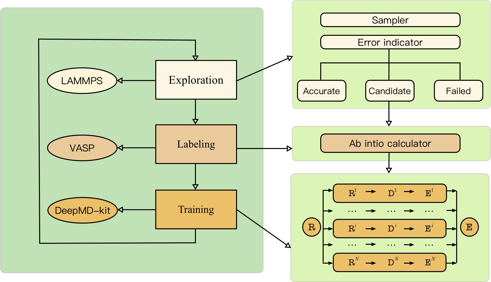
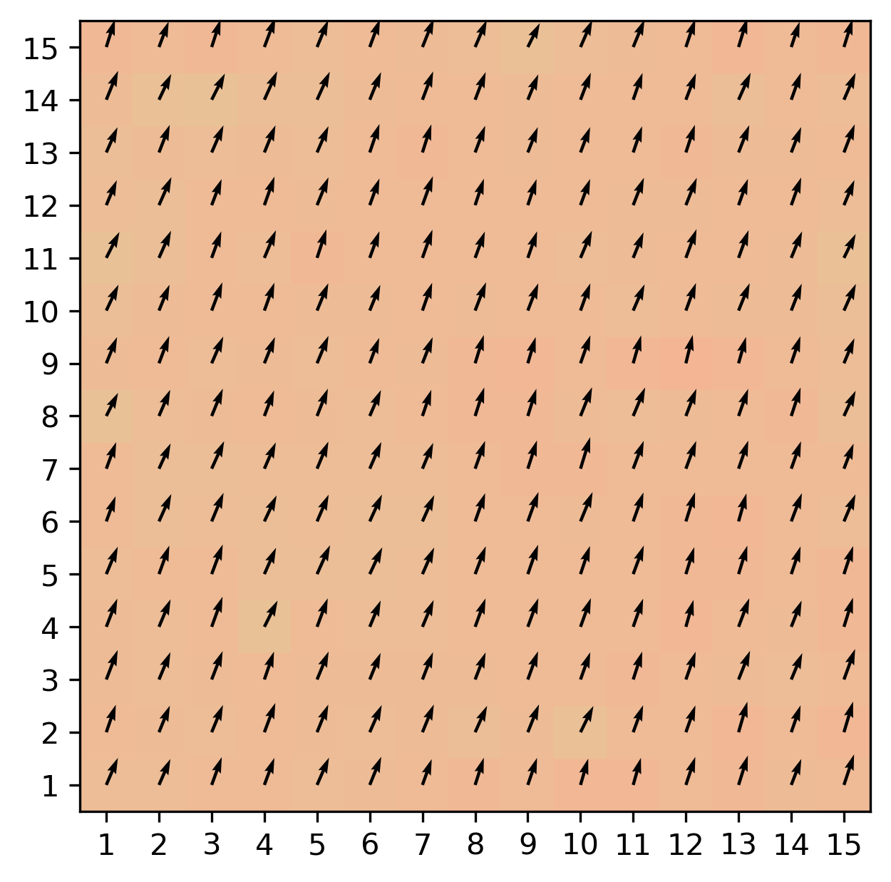
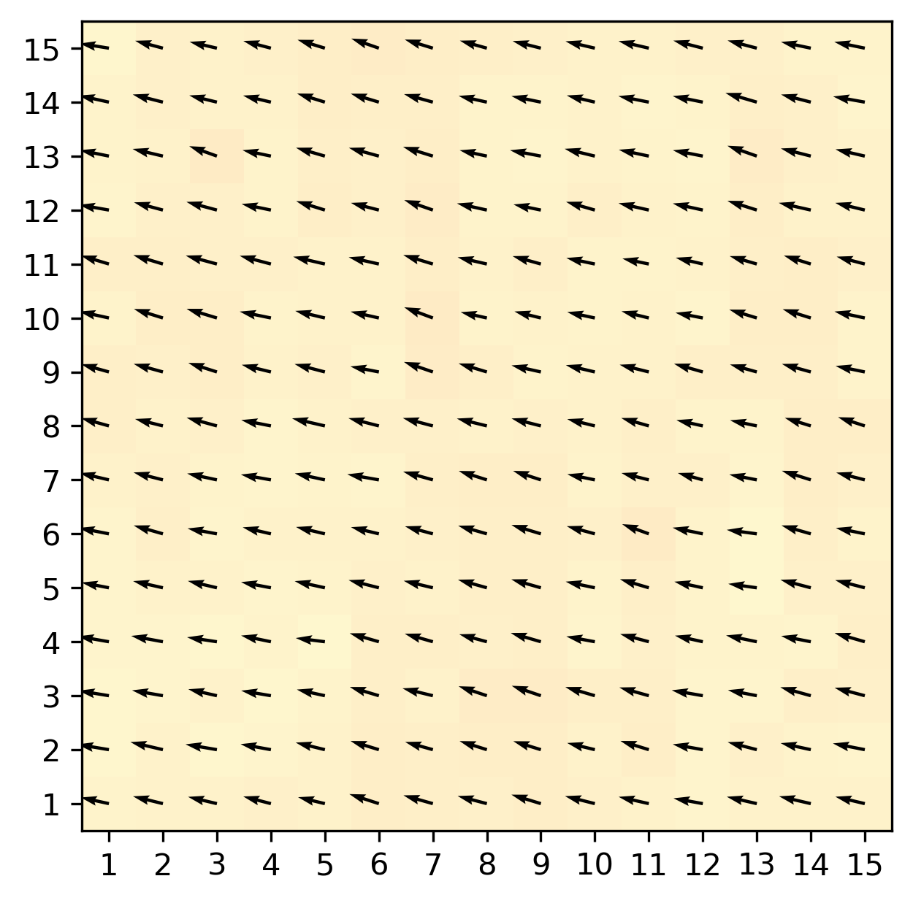
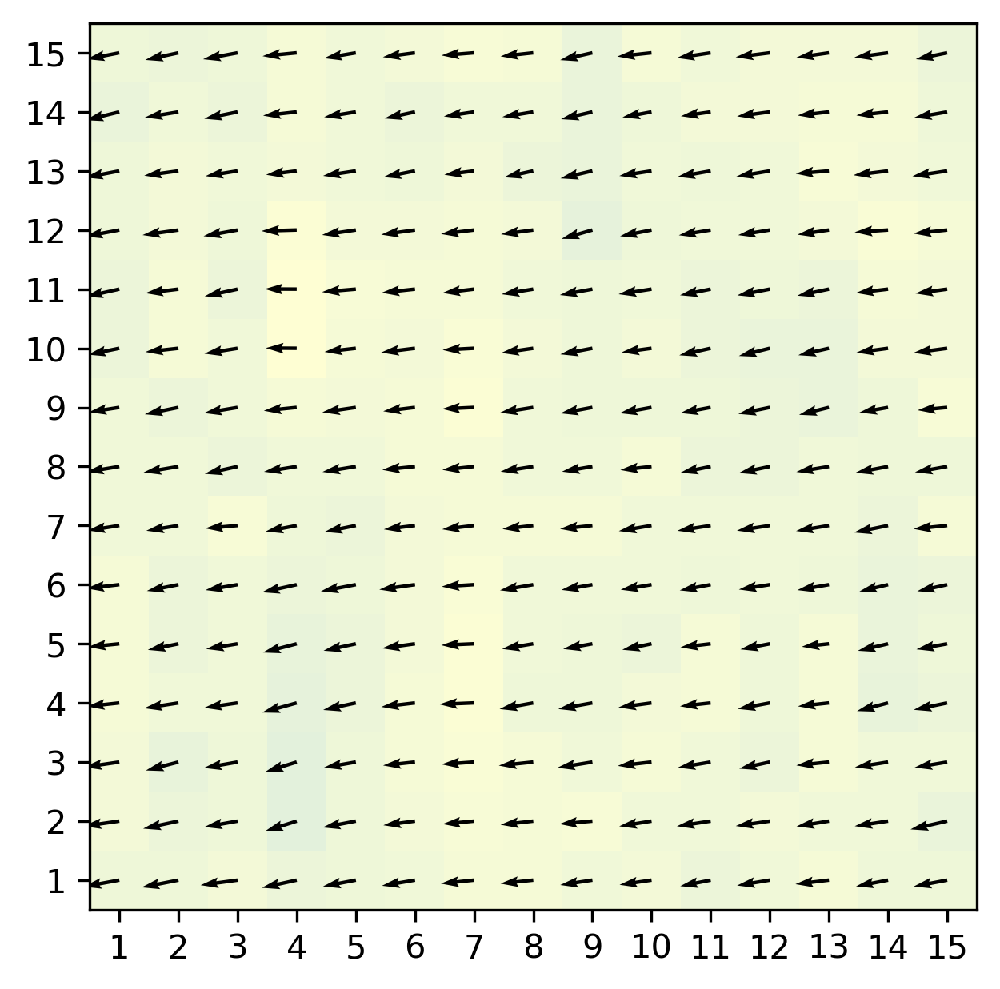
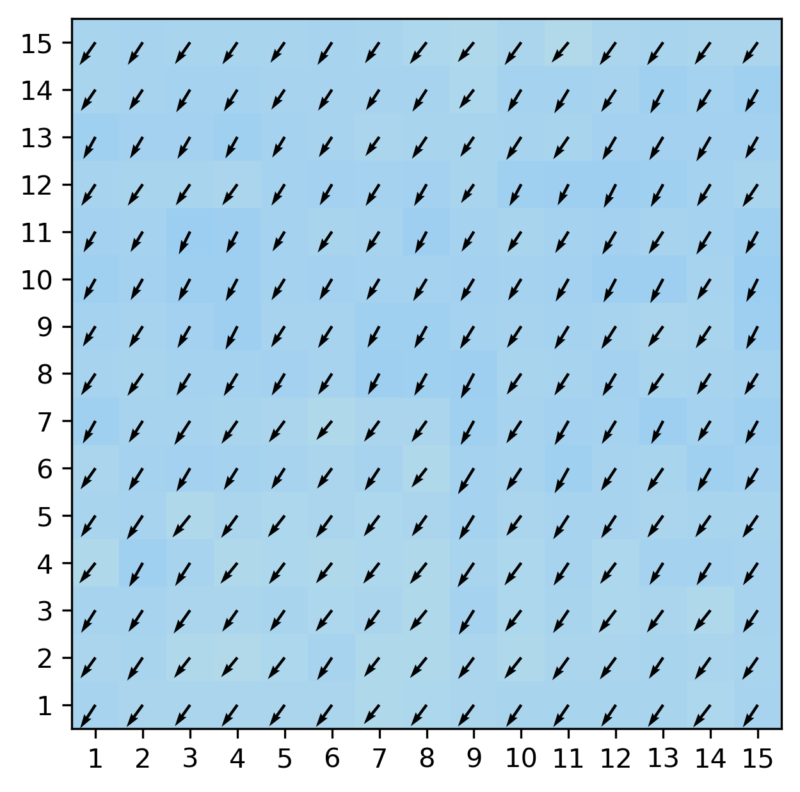
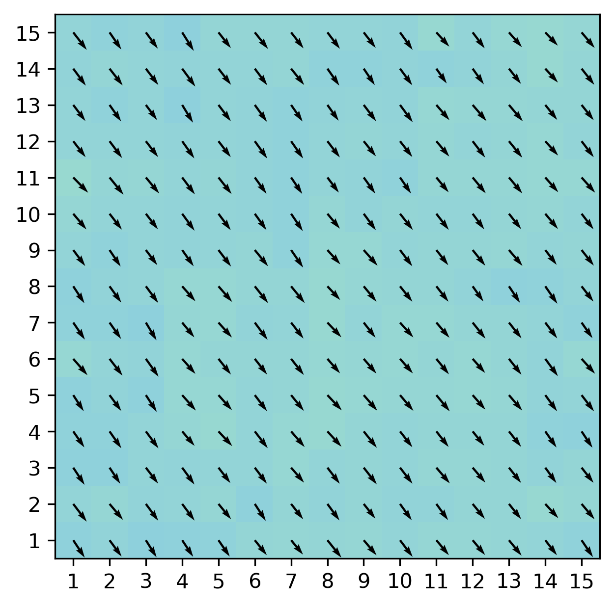
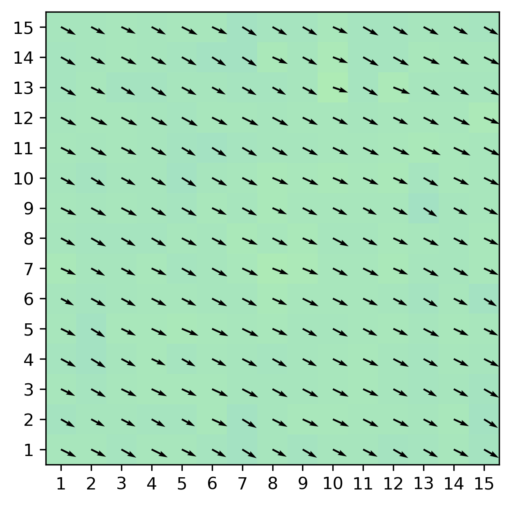
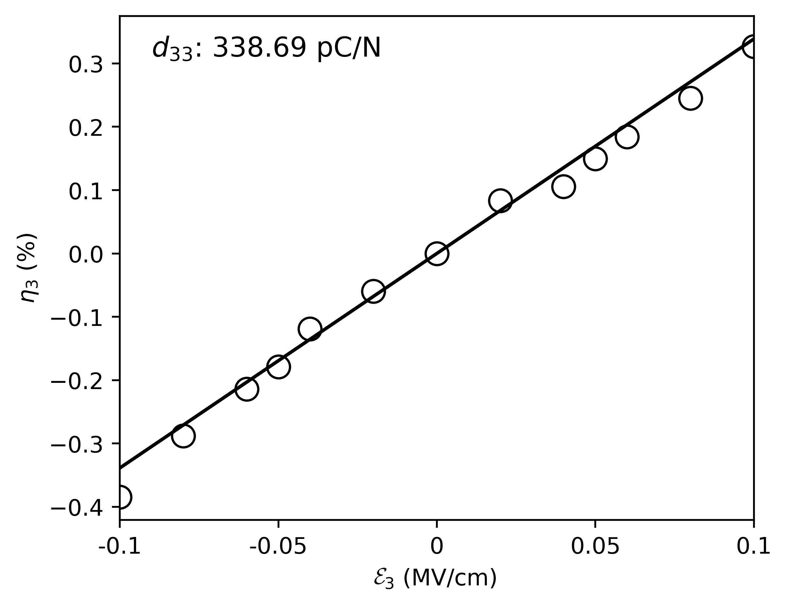

# Giant piezoelectric effects of topological structures in stretched ferroelectric membranes

<div style="color:black; background-color:#FFF3E9; border: 1px solid #FFE0C3; border-radius: 10px; margin-top:1rem; margin-bottom:1rem">
    <p style="margin:1rem; padding-left: 1rem; line-height: 2.5;">
        <a style="font-weight:bold"><em> ©️ <b> <i>Copyright 2024 @ Yihao Hu (胡逸豪)</i></b><br/></a></em>
        <i>Author：
            <b>
            <a href="mailto:huyihao@westlake.edu.cn"> Yihao Hu (胡逸豪) 📨 </a>
            <a href="mailto:yangjiyuan@westlake.edu.cn"> Jiyuan Yang (杨季元) 📨 </a>
            <a href="mailto:liu@westlake.edu.cn"> Shi Liu (刘仕) 📨 </a>
            </b>
        </i>
        <br/>
        <i>Date：2024-01-11</i><br/>
        <i>Lisence：This document is licensed under<a rel="license" href="http://creativecommons.org/licenses/by-nc-sa/4.0/"> Attribution-NonCommercial-ShareAlike 4.0 International (CC BY-NC-SA 4.0) </a>license.<br/>
         📖 <a style="font-weight:bold"> <b>Citing in your papers</b><br/></a>
         <i> We shall greatly appreciate if scientific work done using the published deep potential (<b>DP</b>)  and/or the associated database and scripts for data analysis will contain an acknowledgment to the following references</i><br/>
        <i><a href="https://liutheory.westlake.edu.cn/pdf/PhysRevB.107.144102.pdf"> [1] Giant piezoelectric effects of topological structures in stretched ferroelectric membranes, Yihao Hu, Jiyuan Yang and Shi Liu*, arXiv (2024)</a>
        </i><br/>  
        <i><a href="https://liutheory.westlake.edu.cn/pdf/PhysRevB.107.144102.pdf"> [2] Modular development of deep potential for complex solid solutions, Jing Wu+, Jiyuan Yang+, Liyang Ma, Linfeng Zhang, and Shi Liu*, Phys. Rev. B 107, 144102 (2023)</a>
        </i><br/>       
    </p>
</div>

# 1. Introduction

We share the **force field model**, **essential input files** for density functional theory (DFT) calculations and molecular dynamics (MD) simulations, **data analysis scripts**, and **selected original MD trajectories**, as detailed in our paper [1]. The model file for PbTiO$_3$, together with the complete training database and testing data, can be found in our <a href="https://github.com/huiihao/Spiral">GitHub repository</a>.

<!--The directory is organized as illustrated in the following diagram:

- The `train` directory houses both the training dataset and the `input.json` file which holds the training metadata.
- The `model` directory contains the force field file.
- The `DFT` directory provides a sample `INCAR` file used for DFT scf calculations during the training database construction. 
- Within the `test` directory:
  - The `NEB` directory contains necessary files that compare the DFT and DP energy barriers for various polarization switching pathways in ferroelectric hafnia. See **Section 4.1**.
  - The `Energy barriers` directory contains necessary files that compare the DFT and DP energy barriers for oxygen vacancy diffusion. See **Section 4.2**.
  - The `Piezoelectric` directory is for piezoelectric coefficient $d_{33}$ calculations using finite-field MD simulations. See **Section 4.3**.
  - The `Mobility` directory contains selected MD trajectories and python scripts for oyxgen ion mobility calculations. See **Section 4.4**.

This structure ensures clear categorization and easy navigation for users accessing the files.
-->

The directory is organized as illustrated in the following diagram:

- `train`: Contains the training dataset and the `input.json` file which holds the training metadata. Refer to **Section 2**. Includes a representative `INCAR` file for DFT SCF calculations that were used to construct training database. Refer to **Section 2.3**.
- `model`: Stores the force field file `compress01.pb`.
- `paper`:
  - `DFT_phase_diagram`: Offers method and scripts to implement calculations of DFT phase diagram. Refer to **Section 3.1**.
  - `dipole_spiral`: Offers selected MD trajectories and scripts to implement calculations (Refer to **Section 3.2**.) and demonstrate the robustness of dipole spiral Refer to (**Section 3.3**).
  - `Piezoelectric`: Dedicated to piezoelectric coefficient $d_{33}$ calculations via finite-field MD simulations. Refer to **Section 3.4**.
  - `other_domain`: Offers selected MD trajectories and scripts to implement calculations of various ferroelectric domains. Refer to **Section 3.5**. 

<!--The directory structure is as shown in the following diagram. The training dataset and `input.json` are located in the *train* directory. The force field file is located in the *model* directory. The *DFT* directory provides an `INCAR` file for SCF calculations. The *NEB*, *strain*,  and *Mobility* directories in the *test* directory correspond to the respective tests for polarization switching pathways in ferroelectric hafnia, Energy barriers of oxygen vacancy diffusion, strain vs. Electric Field along the z-axis, and Mobility of oxygen ions.-->

## 2. Database Construction

### 2.1. Training database

The force field of PbTiO$_3$ utilized in this work is a deep neural network-based model potential, referred to as deep potential (**DP**).

Details regarding the construction of the training database, DFT calculations, and metadata of the DP model were documented in our previous work [2]. Specifically, we adopted the **DP-GEN**, a concurrent learning procedure, to construct the training database (see details in **Section 2.1**). The initial training database contains DFT energies and atomic forces for structures derived from random perturbations of ground-state structures of $P4mm$ (tetragonal) and $Pm3m$ (cubic) phases of PbTiO$_3$. The final training database comprises 13021 PbTiO$_3$ configurations. You can access the training database in `Spiral/train/PSTO-data.zip`.

### 2.2. DP-GEN

We employ the Deep Potential Generator (DP-GEN) to construct the training database. DP-GEN is a concurrent learning procedure consisting of three stages: *labeling*, *training*, and *exploration*, which together form a closed loop. Starting with an initial training database that contains DFT energies and forces for a few configurations, four DP models with distinct random initializations of neural networks are *trained*. In the *exploration* phase, one of these models is employed for MD simulations to explore the configuration space. Predictions (energies and atomic forces) are generated using all four models for each new configuration sampled from MD. For configurations that are well represented by the current training database, these four models should display nearly identical predictive accuracy. However, for those not well-represented, we expect the four models to produce scattered predictions with significant deviations. The maximum standard deviation of predictions from the four models serves as a criterion for *labeling*: configurations from MD with significant model deviation are *labeled*. The energies and atomic forces of these labeled configurations, as computed using DFT, are subsequently integrated into the training database for the next *training* cycle. Here, the maximum atomic force standard deviation, denoted as ε, is used as the labeling criterion. We introduce two thresholds, ε<sub>lo</sub> and ε<sub>hi</sub>; only configurations for which ε<sub>lo</sub> < ε < ε<sub>hi</sub> are labeled for DFT calculations. We set ε<sub>lo</sub> = 0.12 and ε<sub>hi</sub> = 0.25. The introduction of ε<sub>hi</sub> is to handle the exceptions due to highly distorted configurations resulting from low-quality DP models (especially in the first few cycles of DP-GEN) or unconverged DFT calculations. The iteration stops when all configurations sampled from MD simulations satisfy a predefined accuracy across all four models.  A primary advantage of the DP-GEN approach is its streamlined and largely autonomous data generation, minimizing human intervention.

<div align=center>
    
</div>

### 2.3. DFT calculations

We employ 2x2x2 supercells of 40 atoms for first-principles DFT calculations using the Vienna Ab initio Simulation (VASP) package. The projected augmented wave method is employed, and the generalized gradient approximation of the Perdew-Burke-Ernzerhof (PBE) type is chosen as the exchange-correlation functional. The energy cutoff is set at 800 eV, and the *k*-spacing is set at 0.3 Å<sup>-1</sup> . A sample `INCAR` file for the self-consistent field (SCF) calculations can be found in the `Spiral/train/` directory.

### 2.4. Deep Potential

The DP model, based on a deep neural network with the number of learnable parameters on the order of 10$^{6}$, offers a robust mathematical structure to represent highly nonlinear and complex interatomic interactions while bypassing the need to handcraft descriptors that represent local atomic environments. Specifically, the DP model features a symmetry-preserving embedding network that maps an atom's local environment to inputs for a fitting neural network which then outputs the atomic energy; the sum of atomic energies yields the total energy. The original references to the DP model can be found in <a href="https://journals.aps.org/prl/abstract/10.1103/PhysRevLett.120.143001">[3]</a> and <a href="https://dl.acm.org/doi/10.5555/3327345.3327356">[4]</a>.

In this study, we utilized the smooth version of the DP model and employed the DEEPMD-KIT package for training. The cutoff radius is set to 6 Å, with smoothing starting at 0.5 Å. The embedding network follows a ResNet-like architecture with dimensions (25, 50, 100). The fitting network consists of three layers, each containing 240 nodes. The loss function is defined as:

$L({p}_\epsilon, {p}_f, {p}_\xi) = {p}_\epsilon \Delta{\epsilon}^2 + \frac{p_f}{3N} \sum_i \left| \Delta{{{\mathbf{F}_i}}} \right|^2 + \frac{p_\xi}{9} \left | \Delta \xi \right |^2$

Here, $\Delta$ represents the difference between DP predictions and training data, $N$ is the number of atoms, $\epsilon$ is the energy per atom, and $\mathbf{F}_i$ is the atomic force of atom $i$. The prefactors ${p}_\epsilon$, ${p}_f$, and ${p}_\xi$ are adjustable parameters. We increased ${p}_\epsilon$ from 0.02 to 1, while reducing ${p}_f$ from 1000 to 1.

The `input.json` file for training is located in the `Spiral/train` directory.

### 2.5. Fitting perfomance

Phonon spectra of (c) tetragonal PTO, and (d) cubic PTO. (f) Temperature dependence of spontaneous polarization and local atomic displacements of Pb and Ti ($D_{\rm Pb}$ and $D_{\rm Ti}$) in PTO from DPMD simulations.

<div align=center>
    
    
    
</div>

Here we compare the energies and atomic forces predicted by DFT and DP for all the structures in the final training database.

The final training database comprises 13021 PbTiO$_3$ configurations and we calculated 231 cases in our paper, as indicated by the red dots in the graph.

The following graph can be plotted using data files `Spiral/paper/DFT_phase_diagram/model-error.dat` and `Spiral/paper/DFT_phase_diagram/Energy-min1st`.

<div align=center>
    
</div>

## 3. Results

### 3.1. DFT phase diagram

The phase diagram of DFT obtained with VASP can be found in the directory `Spiral/paper/DFT_phase_diagram/`. Run the following code to perform DFT calculations.

```bash
bash loop-run.sh
```

After the completion of DFT calculations, retrieve the energies of the final structures corresponding to the initial configurations of A/B/C/D, and sort them in ascending order.

```bash
bash choose-1stEminValue.sh; bash choose-2ndEminValue.sh; bash choose-3rdEminValue.sh; bash choose-4thEminValue.sh
```

By performing data analysis using the script, obtain displacement data `A_Disp.dat-m and B_Disp.dat-m (m = Emin, E2ndmin, E3rdmin , E4thmin)`, and then merge identical configurations based on adjustable criteria such as energy difference and polarization difference.

```bash
bash run-filter.sh
```

Ti atom displacements greater than 0.14 are classified as 1, those smaller than 0.03 are classified as 0, and those in between are denoted as u. By using a plotting script, the right half of **Fig.1** in [1] can be obtained.

```python
python plot-DFT.py
```

Use the output structures from the DFT calculations to perform a subsequent DP calculation (single-point energy calculation) in order to obtain the energy under DP. Combine this data with the test data from the trained model to generate the error plot as shown in the last figure in **Section 2.5**.

> **The following LAMMPS input file settings are applied to all MD cases mentioned in the articles.**

### 3.2. dipole spiral

Here is an example about dipole spiral，The LAMMPS initial structure file `Spiral/paper/dipole_spiral/PTO_C.data` (representing the $c$ domain) is used to submit the computation task to obtain the equilibrium structure. The trajectories can be saved in the `traj` folder. Therefore, it is necessary to manually create the folder `traj` before the computation. We also performed calculations for the case where the initial structure is in the R phase.

```bash
mkdir traj
```

The required LAMMPS input files have been placed in the folder `Spiral/paper/dipole_spiral/continue/`. For the already equilibrated structure (uncertain) `PTO_C.restart`, submit the computation task again to obtain the equilibrium structure.

```bash
cd continue; cp ../RunscriptDP ./ ; cp ../PTO_C.restart ./ ; mkdir traj 
```

The original trajectories file is located in folder `Spiral/paper/dipole_spiral/example_Spiral/15_15_15/traj/` (supercell $15\times15\times15$)，We performed calculations for over 3000 ps, but due to the large file size (more than 2GB), only the data for the last 100 ps is provided here.

Top view (XY plane) of Spiral: (XY cross-sectional plots of different layers in the z-direction)

<div align=center>
        
        
    
</div>

Side view (XZ/YZ plane) of Spiral:

<div align=center>
    
    
</div>

### 3.3. Robustness of dipole spiral

There are also results of Spiral under different supercell sizes in the folder `Spiral/paper/dipole_spiral/example_Spiral/`: `15_15_13/`, represents supercell $15\times15\times13$，`15_15_25/` represents supercell $15\times15\times25$ , `242415/` represents supercell $24\times24\times15$ , `101015/` represents supercell $10\times10\times15$. Due to the large number of files, only the data for 50 ps is provided here. In folder `B_average_disp.dat_XY`, `B_average_disp.dat_YZ`, `B_average_disp.dat_XZ`, you will find cross-sectional plots of the equilibrium structure.

### 3.4. Piezoelectric coefficient $d_{33}​$

Apply an out-of-plane external electric field to the structure after re-equilibration using the file `Spiral/paper/dipole_spiral/continue/PTO_C.restart.continue` and submit the computation task to obtain the equilibrium structure. The required LAMMPS input files with the applied electric field are already placed in folder `Spiral/paper/dipole_spiral/continue/E-0.001/`, with an electric field intensity of -100 kV/cm. We can obtain the equilibrium structures of dipole spiral under various electric fields.

```bash
cd E-0.001; cp ../RunscriptDP ./ ; cp ../PTO_C.restart.continue ./; mkdir traj
```

When the calculations complete, retrieving the lattice from the last 1500 lines of `log.lammps` to calculate the mean and standard deviation, plot the strain as a function of electric field. This reproduces **Fig.2c** in [1].

```bash
grep -B1500 'Loop time' log.lammps | grep -v Loop | awk '{c+=$10/15.0;csq+=$10*$10/225.0} END {print c/NR, sqrt(csq/NR - (c/NR)**2)}'
```

Once we calculate and obtain the equilibrium structures under different electric field intensities, we can plot the variation of strain with electric field intensity. The slope of the line obtained through linear fitting represents the piezoelectric coefficient.

<div align=center>
    
</div>

### 3.5. Other domain

$c/a$ doamin: Due to the large number of files, only the data for 25 ps is provided here `Spiral/paper/other_domain/example_ca/4_40_40`.

$a_1/a_2$ doamin: Due to the large number of files, only the data for 25 ps is provided here `Spiral/paper/other_domain/example_a1a2/40_40_4`.
