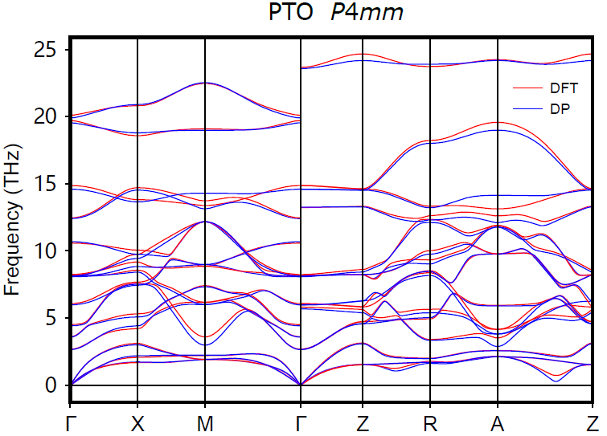
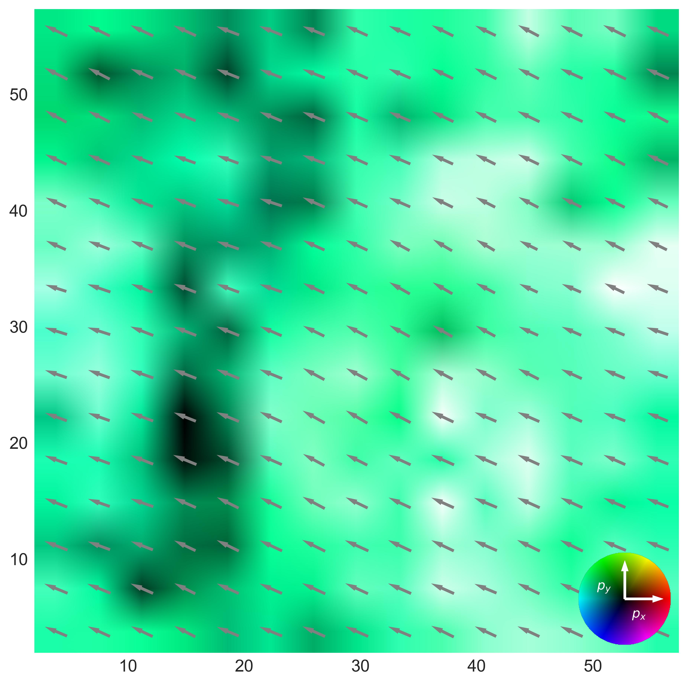
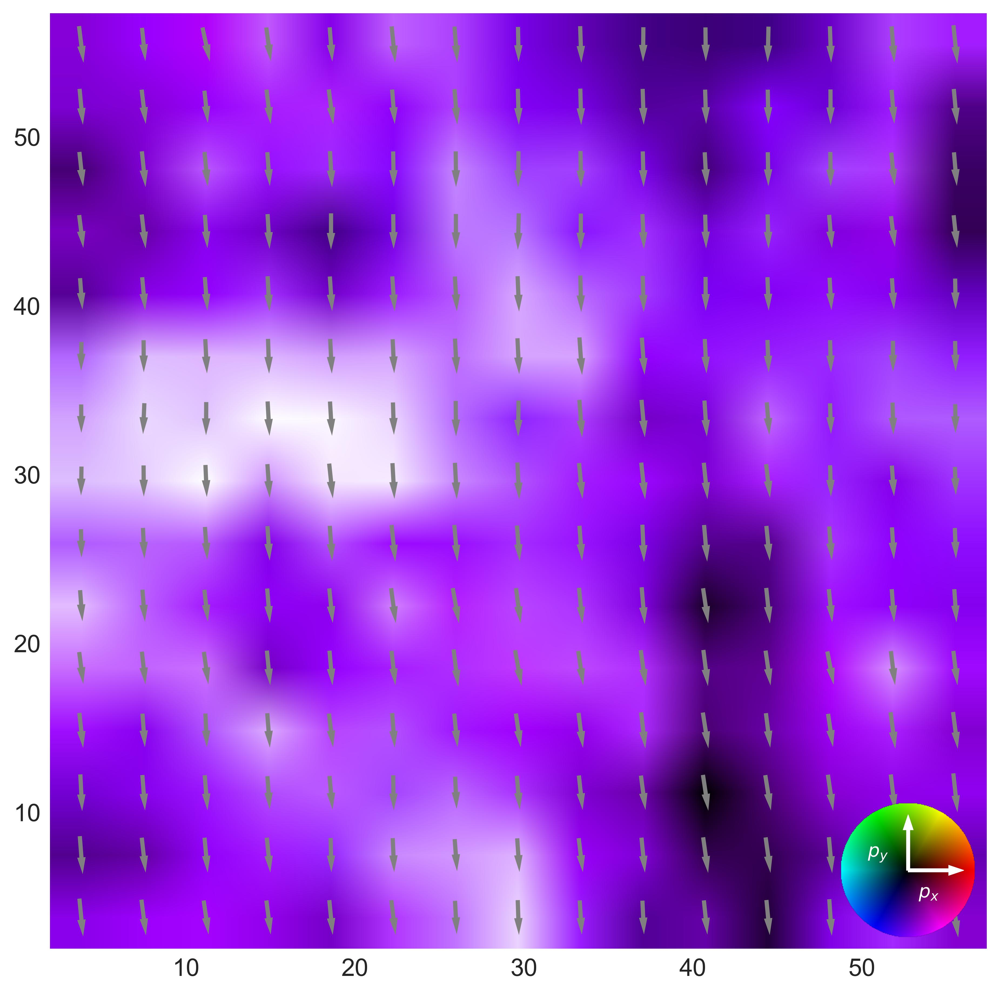

# Giant piezoelectric effect of helical dipole spiral in stretched PbTiO$\rm _3$ membranes

<div style="color:black; background-color:#FFF3E9; border: 1px solid #FFE0C3; border-radius: 10px; margin-top:1rem; margin-bottom:1rem">
    <p style="margin:1rem; padding-left: 1rem; line-height: 2.5;">
        <a style="font-weight:bold"><em> ©️ <b> <i>Copyright 2023 @ Yihao Hu (胡逸豪)</i></b><br/></a></em>
        <i>Author：
            <b>
            <a href="mailto:huyihao@westlake.edu.cn"> Yihao Hu (胡逸豪) 📨 </a>
            <a href="mailto:shiliu@westlake.edu.cn"> Shi Liu (刘仕) 📨 </a>
            </b>
        </i>
        <br/>
        <i>Date：2023-12-04</i><br/>
        <i>Lisence：This document is licensed under<a rel="license" href="http://creativecommons.org/licenses/by-nc-sa/4.0/"> Attribution-NonCommercial-ShareAlike 4.0 International (CC BY-NC-SA 4.0) </a>license.<br/>
         📖 <a style="font-weight:bold"> <b>Citing in your papers</b><br/></a>
         <i> We shall greatly appreciate if scientific work done using the published deep potential (<b>DP</b>)  and/or the associated database and scripts for data analysis will contain an acknowledgment to the following references</i><br/>
        <i><a href="https://liutheory.westlake.edu.cn/pdf/PhysRevB.107.144102.pdf"> [1] Giant piezoelectric effect of helical dipole spiral in stretched PbTiO$_3$ membranes, Yihao Hu, Jiyuan Yang and Shi Liu*, Nature (2023)</a>
        </i><br/>  
        <i><a href="https://liutheory.westlake.edu.cn/pdf/PhysRevB.107.144102.pdf"> [2] Modular development of deep potential for complex solid solutions, Jing Wu+, Jiyuan Yang+, Liyang Ma, Linfeng Zhang, and Shi Liu*, Phys. Rev. B 107, 144102 (2023)</a>
        </i><br/>       
    </p>
</div>

# 1. Introduction

We share the **force field model**, **essential input files** for density functional theory (DFT) calculations and molecular dynamics (MD) simulations, **data analysis scripts**, and **selected original MD trajectories**, as detailed in our paper [1]. The model file for PbTiO$_3$, together with the complete training database and testing data, can be found in our <a href="https://github.com/sliutheorygroup/Spiral">GitHub repository</a>.

<!--The directory is organized as illustrated in the following diagram:

- The `train` directory houses both the training dataset and the `input.json` file which holds the training metadata.
- The `model` directory contains the force field file.
- The `DFT` directory provides a sample `INCAR` file used for DFT scf calculations during the training database construction. 
- Within the `test` directory:
  - The `NEB` directory contains necessary files that compare the DFT and DP energy barriers for various polarization switching pathways in ferroelectric hafnia. See **Section 4.1**.
  - The `Energy barriers` directory contains necessary files that compare the DFT and DP energy barriers for oxygen vacancy diffusion. See **Section 4.2**.
  - The `Piezoelectric` directory is for piezoelectric coefficient $d_{33}$ calculations using finite-field MD simulations. See **Section 4.3**.
  - The `Mobility` directory contains selected MD trajectories and python scripts for oyxgen ion mobility calculations. See **Section 4.4**.

This structure ensures clear categorization and easy navigation for users accessing the files.
-->

The directory is organized as illustrated in the following diagram:

- `train`: Contains the training dataset and the `input.json` file which holds the training metadata. Refer to **Section 2**.
- `model`: Stores the force field file `compress01.pb`.
- `DFT`: Includes a representative `INCAR` file for DFT SCF calculations that were used to construct training database. Refer to **Section 2.3**.
- `paper`:
  - `DFT phase diagram`:
  - `Spiral`: 
  - `Piezoelectric`: Dedicated to piezoelectric coefficient $d_{33}$ calculations via finite-field MD simulations. Refer to **Section 4.3**.
  - `Other domain`: Offers selected MD trajectories and scripts for oxygen ion mobility analysis. Refer to **Section 4.4**. 

<!--The directory structure is as shown in the following diagram. The training dataset and `input.json` are located in the *train* directory. The force field file is located in the *model* directory. The *DFT* directory provides an `INCAR` file for SCF calculations. The *NEB*, *strain*,  and *Mobility* directories in the *test* directory correspond to the respective tests for polarization switching pathways in ferroelectric hafnia, Energy barriers of oxygen vacancy diffusion, strain vs. Electric Field along the z-axis, and Mobility of oxygen ions.-->

## 2. Database Construction

### 2.1. Training database

The force field of PbTiO$_3$ utilized in this work is a deep neural network-based model potential, referred to as deep potential (**DP**).

Details regarding the construction of the training database, DFT calculations, and metadata of the DP model were documented in our previous work [2]. Specifically, we adopted the **DP-GEN**, a concurrent learning procedure,

to construct the training database (see details in **Section 2.1**). The initial training database contains DFT energies and atomic forces for structures derived from random perturbations of ground-state structures of $P4mm$ (tetragonal) and $Pm3m$ (cubic) phases of PbTiO$_3$. The final training database comprises 13021 PbTiO$_3$ configurations. You can access the training database in `pto/`.

### 2.2. DP-GEN

We employ the Deep Potential Generator (DP-GEN) to construct the training database. DP-GEN is a concurrent learning procedure consisting of three stages: *labeling*, *training*, and *exploration*, which together form a closed loop. Starting with an initial training database that contains DFT energies and forces for a few configurations, four DP models with distinct random initializations of neural networks are *trained*. In the *exploration* phase, one of these models is employed for MD simulations to explore the configuration space. Predictions (energies and atomic forces) are generated using all four models for each new configuration sampled from MD. For configurations that are well represented by the current training database, these four models should display nearly identical predictive accuracy. However, for those not well-represented, we expect the four models to produce scattered predictions with significant deviations. The maximum standard deviation of predictions from the four models serves as a criterion for *labeling*: configurations from MD with significant model deviation are *labeled*. The energies and atomic forces of these labeled configurations, as computed using DFT, are subsequently integrated into the training database for the next *training* cycle. Here, the maximum atomic force standard deviation, denoted as ε, is used as the labeling criterion. We introduce two thresholds, ε<sub>lo</sub> and ε<sub>hi</sub>; only configurations for which ε<sub>lo</sub> < ε < ε<sub>hi</sub> are labeled for DFT calculations. We set ε<sub>lo</sub> = 0.12 and ε<sub>hi</sub> = 0.25. The introduction of ε<sub>hi</sub> is to handle the exceptions due to highly distorted configurations resulting from low-quality DP models (especially in the first few cycles of DP-GEN) or unconverged DFT calculations. The iteration stops when all configurations sampled from MD simulations satisfy a predefined accuracy across all four models.  A primary advantage of the DP-GEN approach is its streamlined and largely autonomous data generation, minimizing human intervention.

图

### 2.3. DFT calculations

We employ 2x2x2 supercells of 40 atoms for first-principles DFT calculations using the Vienna Ab initio Simulation (VASP) package. The projected augmented wave method is employed, and the generalized gradient approximation of the Perdew-Burke-Ernzerhof (PBE) type is chosen as the exchange-correlation functional. The energy cutoff is set at 800 eV, and the *k*-spacing is set at 0.3 Å<sup>-1</sup> . A sample `INCAR` file for the self-consistent field (SCF) calculations can be found in the `PbTiO3/DFT` directory.

### 2.4. Deep Potential

The DP model, based on a deep neural network with the number of learnable parameters on the order of 10$^{6}$, offers a robust mathematical structure to represent highly nonlinear and complex interatomic interactions while bypassing the need to handcraft descriptors that represent local atomic environments. Specifically, the DP model features a symmetry-preserving embedding network that maps an atom's local environment to inputs for a fitting neural network which then outputs the atomic energy; the sum of atomic energies yields the total energy. The original references to the DP model can be found in <a href="https://journals.aps.org/prl/abstract/10.1103/PhysRevLett.120.143001">[3]</a> and <a href="https://dl.acm.org/doi/10.5555/3327345.3327356">[4]</a>.

In this study, we utilized the smooth version of the DP model and employed the DEEPMD-KIT package for training. The cutoff radius is set to 6 Å, with smoothing starting at 0.5 Å. The embedding network follows a ResNet-like architecture with dimensions (25, 50, 100). The fitting network consists of three layers, each containing 240 nodes. The loss function is defined as:

\begin{equation}

L({p}_\epsilon, {p}_f, {p}_\xi) = {p}_\epsilon \Delta{\epsilon}^2 + \frac{p_f}{3N} \sum_i \left| \Delta{{{\mathbf{F}_i}}} \right|^2 + \frac{p_\xi}{9} \left | \Delta \xi \right |^2

\end{equation}

Here, $\Delta$ represents the difference between DP predictions and training data, $N$ is the number of atoms, $\epsilon$ is the energy per atom, and $\mathbf{F}_i$ is the atomic force of atom $i$. The prefactors ${p}_\epsilon$, ${p}_f$, and ${p}_\xi$ are adjustable parameters. We increased ${p}_\epsilon$ from 0.02 to 1, while reducing ${p}_f$ from 1000 to 1.

The `input.json` file for training is located in the `PbTiO3/train` directory.

### 2.5. Fitting perfomance

Phonon spectra of (c) tetragonal PTO, and (d) cubic PTO. (f) Temperature dependence of spontaneous polarization and local atomic displacements of Pb and Ti ($D_{\rm Pb}$ and $D_{\rm Ti}$) in PTO from DPMD simulations.

<div align=center>
    
    
    
</div>

Here we compare the energies and atomic forces predicted by DFT and DP for all the structures in the final training database.

13021个database的数据点，231个我们paper的数据点
利用`Spiral/paper/DFT_phase_diagram/model-error.dat`以及`Spiral/paper/DFT_phase_diagram/Energy-min1st`文件可以画出下图

<div align=center>
    
    
</div>

## DFT phase diagram

The phase diagram of DFT obtained with VASP can be found in the directory `Spiral/paper/DFT_phase_diagram`. 运行以下代码跑DFT计算

```bash
bash loop-run.sh
```

计算完成后，抓取ABCD四种构型的能量并从小到大排序

```bash
bash choose-1stEminValue.sh; bash choose-2ndEminValue.sh; bash choose-3rdEminValue.sh; bash choose-4thEminValue.sh
```

通过脚本数据分析，获得位移数据A_Disp.dat-m and B_Disp.dat-m (m = Emin, E2ndmin, E3rdmin , E4thmin)，然后合并相同构型(可调整判定条件：能量差，极化差)

```bash
bash run-filter.sh
```

根据画图脚本(判定v10的标准，以及构型是否一致)，可以获得**Fig.1** in [1]右半部分。

```python
python plot-DFT.py
```

After complete runing VASP calculations, 拿DFT的输出结构继续跑一个DP计算（scf计算）以获得DP下的能量。与训练模型测试的数据一起，获得2.5中的误差图。

> 以下lammps的input file设置均应用于所有文章中所有涉及到的的MD case

## Spiral

从DFT的结构，转到计算DP，DP自由度提高，将会出现畴结构。

这里提供一个与Spiral有关的例子，`Spiral/paper/domain`lammps的初始结构PTO_C.data(为 c domain)，然后可以提交任务跑平衡，trajectories保存到文件夹`traj`中所以计算前得手动创建`traj`（我们还run了初始结构为R phase的情形）

```bash
mkdir traj
```

文件夹`Spiral/paper/domain/continue`中已放置所需的lammps输入文件，对平衡后的结构PTO_C.restart进一步跑平衡

```bash
cd continue; cp ../RunscriptDP ./ ; cp ../PTO_C.restart ./ ; mkdir traj 
```

原始trajectories文件放在`Spiral/paper/domain/example_Spiral/15_15_15/traj/`下(supercell $15\times15\times15$)，我们跑了超过3000ps，由于文件太大，这里只放最后100ps的数据 (more than 2GB)

Top view (XY plane) of Spiral: (z方向不同层)

<div align=center>
        
        
    
</div>

Side view (XZ/YZ plane) of Spiral:

<div align=center>
    
    
</div>

`Spiral/paper/domain/example_Spiral/`下还有不同Spiral尺寸超胞的结果: `15_15_13/`即$15\times15\times13$，`15_15_25/`即$15\times15\times25$ , `242415/`即$24\times24\times15$ , `101015/`即$10\times10\times15$. 由于文件较多，这里只放50ps的数据. 其中，`B_average_disp.dat_XY`, `B_average_disp.dat_YZ`, `B_average_disp.dat_XZ`中为平衡结构的粗略截面图。

## Piezoelectric coefficient $d_{33}​$

对再次平衡后的结构PTO_C.restart.continue施加外电场并跑平衡, 文件夹`Spiral/paper/domain/continue/E-0.001`中已放置所需的施加了电场的lammps输入文件，此时电场强度为-100 kV/cm。obtain the equilibrium structures of Spiral under various electric fields.

```bash
cd E-0.001; cp ../RunscriptDP ./ ; cp ../PTO_C.restart.continue ./; mkdir traj
```

When the calculations complete, 抓取输出结构后1500行的晶格平均以及标准差，plot the strain as a function of electric field. This reproduces Fig.2c in [1].

```bash
grep -B1500 'Loop time' log.lammps | grep -v Loop | awk '{c+=$10/15.0;csq+=$10*$10/225.0} END {print c/NR, sqrt(csq/NR - (c/NR)**2)}'
```

## Other domain （c/a a1/a2）

`Spiral/paper/domain/example_a1a2/40_40_4`以及不同畴结构的例子, 由于文件较多，这里只放25ps的数据。`Spiral/paper/domain/example_ca/4_40_40`以及不同畴结构的例子, 由于文件较多，这里只放25ps的数据。
